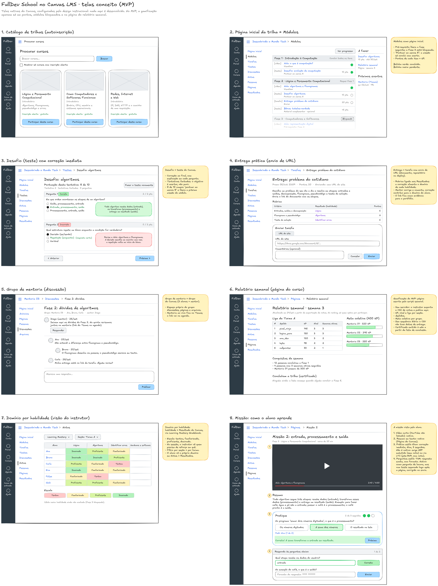

# Projeto de Interface

A interface da FullDev School sera organizada em tres frentes: site institucional, plataforma de cursos e hub comunitario. O site institucional apresenta o projeto; a plataforma de cursos concentra aprendizagem, progresso e evidencias; o hub centraliza forum, vagas, eventos e oportunidades de networking.

## Principios de Interface

- Clareza: telas com linguagem direta e poucas decisoes simultaneas.
- Acessibilidade: contraste adequado, navegacao responsiva e conteudo facil de ler.
- Foco em pratica: atividades, desafios e projetos devem aparecer como elementos centrais.
- Transparencia: status de inscricao, entrega e curadoria devem ser visiveis.
- Confianca: conteudos aprovados devem indicar validacao academica.
- Comunidade: discussoes, mentoria e colaboracao devem ser acessiveis a partir da jornada de estudo.

## Diagrama de Fluxo

Fluxo principal do participante:

1. Acessar o site institucional ou entrar diretamente na plataforma.
2. Consultar catalogo gratuito de cursos e atividades.
3. Filtrar por tema, nivel, formato ou disponibilidade.
4. Abrir detalhes da atividade.
5. Realizar inscricao.
6. Acompanhar aulas ou modulos liberados por cadencia.
7. Participar de forum ou discussao vinculada ao curso.
8. Registrar entrega ou evidencia.
9. Avaliar a atividade.

Fluxo principal do hub:

1. Acessar hub comunitario.
2. Escolher entre forum, vagas ou eventos.
3. Consultar uma oportunidade, discussao ou agenda.
4. Interagir conforme permissao do usuario.

Fluxo principal do autor:

1. Acessar area de autoria.
2. Preencher proposta de trilha, oficina, curso, desafio ou projeto.
3. Enviar para curadoria.
4. Acompanhar status da avaliacao.
5. Ajustar conteudo quando solicitado.
6. Publicar atividade apos aprovacao.

Fluxo principal do professor validador:

1. Acessar painel de curadoria.
2. Visualizar conteudos pendentes.
3. Analisar objetivos, publico, prerequisitos, atividade pratica e criterios de avaliacao.
4. Aprovar, solicitar ajustes ou reprovar.
5. Registrar parecer de validacao.

## Wireframes

### Tela 1: Site Institucional

Elementos principais:

- Apresentacao da FullDev School.
- Problema, solucao e publico-alvo.
- Explicacao das tres frentes do produto.
- Equipe, parceiros e validacao academica.
- Chamadas para entrar como aluno, instrutor ou apoiador.

### Tela 2: Catalogo de Cursos e Atividades

Elementos principais:

- Cabecalho com busca e acesso a login.
- Filtros por tema, nivel, formato e disponibilidade.
- Lista de atividades com tipo, titulo, nivel, duracao e status.
- Destaque para atividades abertas e gratuitas.
- Link para detalhes da atividade.

### Tela 3: Detalhe da Atividade

Elementos principais:

- Titulo, descricao, tipo de atividade e nivel.
- Objetivos de aprendizagem.
- Prerequisitos.
- Formato: oficina, curso, desafio, hackathon, squad ou projeto.
- Informacoes de prazo, vagas e responsaveis.
- Cadencia de liberacao quando a atividade for curso ou trilha.
- Botao de inscricao gratuita.
- Indicacao de validacao academica quando aplicavel.

### Tela 4: Area do Participante

Elementos principais:

- Atividades inscritas.
- Status de participacao.
- Progresso por aula ou modulo.
- Entregas praticas registradas.
- Historico de avaliacoes.
- Evidencias para portfolio.

### Tela 5: Hub Comunitario

Elementos principais:

- Forum por curso, modulo ou assunto.
- Vagas e oportunidades para iniciantes.
- Agenda de eventos, hackathons, oficinas e encontros.
- Comunicados da comunidade.

### Tela 6: Submissao de Conteudo

Elementos principais:

- Formulario para titulo, descricao, publico, objetivos, prerequisitos e formato.
- Campo para atividade pratica proposta.
- Campo para criterios de conclusao.
- Envio para curadoria.
- Historico de feedback.

### Tela 7: Painel de Curadoria e Indicadores

Elementos principais:

- Lista de conteudos pendentes.
- Acoes de aprovar, solicitar ajustes ou reprovar.
- Parecer de validacao.
- Indicadores de inscritos, permanencia, entregas, satisfacao e engajamento.

### Telas de baixa fidelidade no Canvas

Proposta: telas da plataforma de cursos no Canvas LMS, conforme a [Arquitetura da Solucao](./05-arquitetura-da-solucao.md). Sao telas nativas do Canvas, configuradas pelo design instrucional.

## Navegacao Prevista

- Inicio
- Institucional
- Cursos
- Minhas atividades
- Hub
- Vagas
- Eventos
- Submeter atividade
- Curadoria
- Indicadores
- Entrar/Cadastrar
